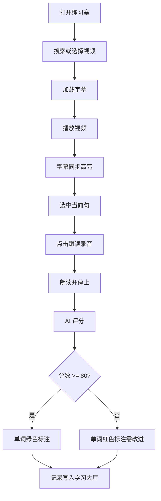

# Vlog English Pro — 产品需求文档（PRD）

| 项目 | 内容 |
|------|------|
| 产品名称 | Vlog English Pro |
| 版本 | v1.0.0 |
| 文档日期 | 2026-06-25 |
| 产品类型 | Web 英语学习应用 |

---

## 1. 产品概述

### 1.1 产品定位

Vlog English Pro 是一款基于 YouTube Vlog 视频的**沉浸式英语口语练习工具**。用户通过观看真实 Vlog 内容，结合同步字幕、跟读录音与 AI 发音评分，在真实语境中提升听力和口语能力。

### 1.2 目标用户

| 用户群体 | 特征 | 核心诉求 |
|----------|------|----------|
| 英语自学者 | 18–35 岁，有一定基础 | 用真实视频练口语，不想枯燥背单词 |
| Vlog 爱好者 | 常看 YouTube/TED | 边看边学，查词、跟读 |
| 备考/面试人群 | 需要口语练习反馈 | 获得发音准确度与流利度评分 |

### 1.3 产品价值

- **真实语境**：YouTube Vlog、TED 等原生内容，而非教材对话
- **即时反馈**：Azure 语音评测，逐词标注发音问题
- **低门槛**：浏览器即可使用，无需安装 App
- **个性化**：生词本、学习记录本地持久化

---

## 2. 功能需求

### 2.1 功能架构

```
Vlog English Pro
├── 练习室（首页）
│   ├── YouTube 视频搜索
│   ├── 分类筛选（Vlog / TED / 美妆 / 音乐 / 访谈）
│   ├── 视频列表与切换
│   ├── 嵌入式 YouTube 播放器
│   ├── 同步字幕（台词本）
│   ├── 点击单词查词典
│   ├── 句子跳转与键盘快捷键
│   └── 跟读录音 + AI 发音评分
├── 学习大厅
│   ├── 累计练习次数
│   ├── 最高得分
│   ├── 生词积累数量
│   └── 练习历史记录表格
└── 生词本
    ├── 单词列表与释义
    ├── 单词发音（TTS）
    └── 批量标记已学会
```

### 2.2 核心功能详述

#### F1 — YouTube 视频搜索与播放

| 属性 | 说明 |
|------|------|
| 优先级 | P0 |
| 描述 | 用户输入关键词搜索 YouTube 视频，选择后在页面内嵌播放 |
| 输入 | 搜索关键词（如 "TED"、"vlog my life"） |
| 输出 | 视频列表（缩略图、标题、频道名），选中后加载播放器 |
| 技术依赖 | YouTube Data API v3、YouTube IFrame Player API |
| 验收标准 | 搜索返回 ≤10 条结果；点击可正常播放；嵌入受限视频有明确错误提示 |

#### F2 — 多源字幕获取与同步

| 属性 | 说明 |
|------|------|
| 优先级 | P0 |
| 描述 | 自动获取视频英文字幕，播放时高亮当前句，支持点击跳转 |
| 字幕来源优先级 | 本地缓存 → youtube-transcript-api → yt-dlp → 演示备用数据 |
| 同步机制 | 每 100ms 读取播放进度，匹配字幕时间轴 |
| 交互 | 点击句子跳转；Alt + 方向键切换句子；Space 播放/暂停 |
| 验收标准 | 有字幕的视频 100% 同步高亮；无字幕时显示友好提示 |

#### F3 — 跟读录音与 AI 发音评分

| 属性 | 说明 |
|------|------|
| 优先级 | P0 |
| 描述 | 用户对当前句跟读，系统录音并调用 Azure 发音评估 API 打分 |
| 输入 | 麦克风音频（WAV）、参考文本（当前字幕句） |
| 输出 | 总分、准确度、流利度；逐词评分（优秀/需改进/未读） |
| 限制 | 单次录音最长 30 秒 |
| 技术依赖 | Web Audio API、Azure Cognitive Services Speech |
| 验收标准 | 评分结果 5 秒内返回；单词级高亮与图例一致 |

#### F4 — 交互式词典

| 属性 | 说明 |
|------|------|
| 优先级 | P1 |
| 描述 | 点击字幕中的单词弹出释义，支持加入生词本 |
| 数据源 | 第三方词典 API（中英文释义、音标） |
| 验收标准 | 点击单词 2 秒内显示释义；可一键加入生词本 |

#### F5 — 生词本

| 属性 | 说明 |
|------|------|
| 优先级 | P1 |
| 描述 | 管理用户收藏的单词，支持 TTS 朗读与批量删除 |
| 存储 | localStorage（浏览器本地） |
| 验收标准 | 添加/删除即时生效；刷新页面数据不丢失 |

#### F6 — 学习大厅

| 属性 | 说明 |
|------|------|
| 优先级 | P1 |
| 描述 | 展示练习统计与历史记录 |
| 指标 | 累计练习次数、最高得分、生词数量 |
| 存储 | localStorage |
| 验收标准 | 每次跟读评分成功后自动写入历史 |

---

## 3. 非功能需求

| 类别 | 要求 |
|------|------|
| 性能 | 字幕加载 < 5s（有缓存 < 1s）；页面首屏 < 3s |
| 兼容性 | Chrome / Edge / Firefox 最新两个主版本；需麦克风权限 |
| 安全 | API Key 通过环境变量注入，不提交至代码仓库 |
| 可用性 | 深色主题，类 YouTube 布局，中文界面 |
| 可维护性 | 前后端分离；字幕多源 fallback 机制 |

---

## 4. 用户流程

### 4.1 主流程：跟读练习



### 4.2 查词流程

用户点击字幕单词 → 弹出词典卡片 → 查看释义/音标 → 可选「加入生词本」

---

## 5. 界面结构

| 区域 | 组件 | 说明 |
|------|------|------|
| 顶栏 | Logo、菜单、搜索框、生词本入口 | 固定 sticky |
| 左侧栏 | 分类标签、视频列表 | 宽 360px |
| 主内容 | YouTube 播放器、台词本 | 自适应 |
| 底栏 | 跟读按钮、评分结果 | 固定 bottom |
| 抽屉 | 生词本表格 | 右侧滑出 400px |

---

## 6. 数据模型

### 6.1 字幕条目（Transcript Line）

```typescript
{
  text: string      // 字幕文本
  start: number     // 开始时间（秒）
  duration: number  // 持续时长（秒）
}
```

### 6.2 练习记录（Study History）

```typescript
{
  date: string       // 练习时间
  videoTitle: string // 视频标题
  score: number      // 总分
  fluency: number    // 流利度
}
```

### 6.3 生词条目（Vocabulary）

```typescript
{
  word: string       // 单词
  definition: string // 释义（HTML）
}
```

---

## 7. API 接口（后端）

| 方法 | 路径 | 说明 |
|------|------|------|
| GET | `/` | 健康检查 |
| GET | `/transcript?video_id=` | 获取 YouTube 字幕 |
| GET | `/ted-transcript?talk_url=` | 获取 TED 字幕 |
| POST | `/assess` | 发音评估（multipart: file + reference_text） |
| GET | `/cache-list` | 列出字幕缓存 |
| POST | `/clear-cache` | 清除字幕缓存 |

---

## 8. 版本规划

| 版本 | 范围 | 状态 |
|------|------|------|
| v1.0 | 搜索、播放、字幕、跟读评分、生词本、学习大厅 | ✅ 已完成 |
| v1.1 | 用户登录、云端同步生词本 | 规划中 |
| v1.2 | 学习计划、每日提醒、进度曲线 | 规划中 |
| v2.0 | 移动端适配、离线模式 | 规划中 |

---

## 9. 风险与依赖

| 风险 | 影响 | 缓解措施 |
|------|------|----------|
| YouTube API 配额限制 | 搜索不可用 | 预置测试视频；提示用户配置 Key |
| 部分视频禁止嵌入 | 无法播放 | 明确错误码提示，建议换视频 |
| 无英文字幕 | 无法跟读 | 多源 fallback + 演示字幕 |
| Azure Speech 未配置 | 无法评分 | 后端返回友好错误信息 |
| 浏览器拒绝麦克风 | 无法录音 | 引导用户授权 |

---

## 10. 成功指标（KPI）

| 指标 | 目标 |
|------|------|
| 字幕加载成功率 | ≥ 85%（有英文字幕的视频） |
| 跟读评分响应时间 | ≤ 5 秒 |
| 单次会话跟读句数 | ≥ 3 句 |
| 生词本使用率 | ≥ 30% 活跃用户添加 ≥1 词 |
